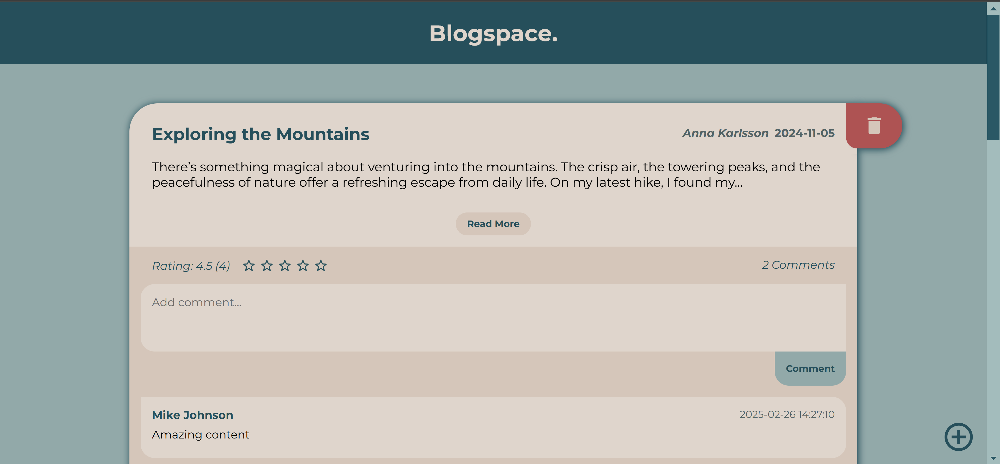

# Blogspace
A clean, minimalist blog platform built with vanilla HTML, CSS, and JavaScript.\
Blogspace features a responsive design with smooth animations and an intuitive user interface.
## Features

Create and publish blog posts with formatted titles\
Expand/collapse long articles with "Read More" functionality\
Interactive rating system with star ratings\
Comment sections for each post\
Responsive design that works on mobile and desktop\
Sleek deletion interface with slide-out animation\
Clean, modern aesthetic with rounded cards and subtle shadows

## Technical Details
Blogspace is built entirely with:

HTML5\
CSS3 \
Vanilla JavaScript (no frameworks or libraries)\
\
All data is currently stored in-memory, making this perfect for demonstration purposes or as a starting point for a more complex application with backend integration.
## Getting Started

Clone this repository\
Open index.html in your browser\
Start reading or create your own post using the + button\

## Future Improvements

User authentication system\
Local storage or backend database integration\
Rich text editing for posts\
Image upload support\
Categorization and tagging system

## Preview
